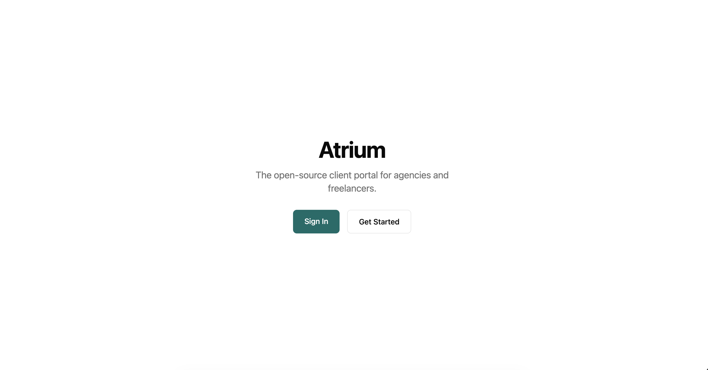
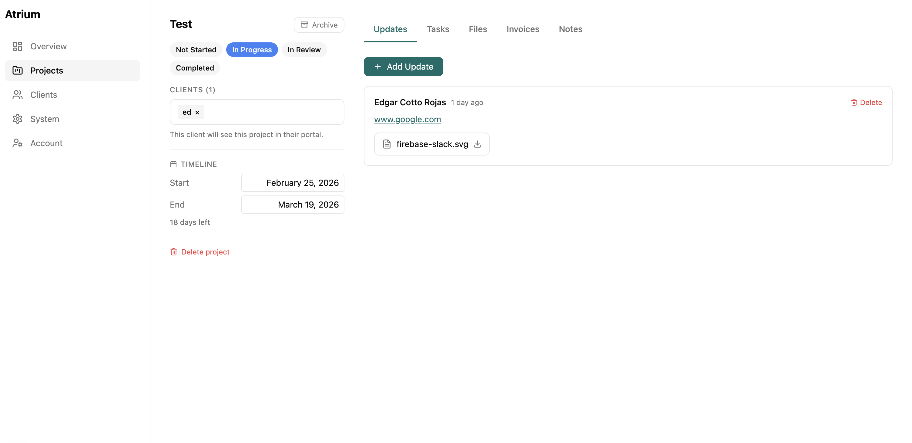

# Atrium

**A self-hosted client portal for agencies and freelancers.**

[Website](https://atrium.vibralabs.co) | [Documentation](docs/configuration.md) | [GitHub Issues](https://github.com/Vibra-Labs/Atrium/issues)

Created by [@edgarjc](https://github.com/edgarjc) -- Built out of frustration with the tools I was using to manage client work.

[](https://www.elastic.co/licensing/elastic-license)




## Why Atrium?

Most agencies juggle shared drives, spreadsheets, and scattered emails to keep clients in the loop. Atrium replaces all of that with a single branded portal your clients can log into -- no more "can you resend that file?" emails. Unlike managed SaaS platforms, you own the data and host it yourself.



## Features

- **Project management** -- Customizable status pipeline per organization
- **File sharing** -- Upload and deliver files via S3, MinIO, Cloudflare R2, or local storage
- **White-label branding** -- Custom colors and logo applied to the client portal
- **Role-based access** -- Owner/admin roles for your team, member role for clients
- **Authentication** -- Magic link and email/password auth via Better Auth
- **Multi-tenant** -- Each agency operates as its own isolated organization

## Tech Stack

| Layer     | Technology                  |
|-----------|-----------------------------|
| API       | NestJS 11                   |
| Frontend  | Next.js 15, React 19        |
| Database  | PostgreSQL 16, Prisma ORM   |
| Auth      | Better Auth                 |
| Styling   | Tailwind CSS                |
| Email     | Resend + React Email        |
| Monorepo  | Turborepo + Bun             |

## Getting Started

### Local Development

**Prerequisites:** [Bun](https://bun.sh) (v1.0+) and [Docker](https://docs.docker.com/get-docker/) (for PostgreSQL).

```bash
git clone https://github.com/Vibra-Labs/Atrium.git
cd atrium
bun install
bun run setup
bun run dev
```

This starts the web app at [localhost:3000](http://localhost:3000) and the API at [localhost:3001](http://localhost:3001). The `setup` script handles env files, database, and seed data automatically.

### Docker (Production)

A pre-built image is available on Docker Hub:

```bash
docker pull vibralabs/atrium:latest
```

The quickest way to run Atrium with PostgreSQL:

```bash
curl -O https://raw.githubusercontent.com/Vibra-Labs/Atrium/main/docker-compose.yml
BETTER_AUTH_SECRET=$(openssl rand -base64 32) \
POSTGRES_PASSWORD=your-secure-password \
docker compose up -d
```

Or build from source:

```bash
git clone https://github.com/Vibra-Labs/Atrium.git
cd atrium
docker compose up --build -d
```

The unified image (`vibralabs/atrium`) bundles the API, web app, and a Caddy reverse proxy into a single container on port 8080. It works with any container platform — Docker Compose, Coolify, Portainer, Unraid, etc.

### First Use

1. Open [localhost:3000/signup](http://localhost:3000/signup) and create your account
2. Create projects, upload files, and manage statuses from the **dashboard**
3. Invite clients by email -- they access the **client portal** at `/portal`

## Documentation

- [Docker Deployment](docs/docker.md)
- [Configuration & Environment Variables](docs/configuration.md)
- [Development Guide & Scripts](docs/development.md)
- [Security](docs/security.md)

## Roadmap

- [x] Billing & subscriptions (Stripe)
- [x] Setup wizard for new organizations
- [x] Email notifications (Resend + SMTP)
- [x] Docker Hub image (`vibralabs/atrium`)
- [x] Unraid Community App template
- [ ] Contract signatures
- [ ] Client-facing invoice payments
- [ ] Webhooks / Zapier integration

## Contributing

Contributions are welcome! Here's how to get involved:

1. **Open an issue first** -- Whether it's a bug report, feature idea, or improvement, start with a [GitHub Issue](https://github.com/Vibra-Labs/Atrium/issues) so we can discuss before you write code.
2. **Keep PRs focused** -- Small, single-purpose pull requests are easier to review and merge.
3. **Bug fixes and improvements welcome** -- New features should be discussed in an issue first to make sure they align with the project direction.

## Community & Support

- **Bug reports & feature requests** -- [GitHub Issues](https://github.com/Vibra-Labs/Atrium/issues)
- **Questions & discussions** -- [GitHub Discussions](https://github.com/Vibra-Labs/Atrium/discussions)

If you find Atrium useful, consider giving it a star -- it helps others discover the project.

## License

Atrium is source-available software licensed under the [Elastic License 2.0 (ELv2)](LICENSE). You are free to use, modify, and self-host Atrium. The license restricts offering it as a managed service to third parties.
